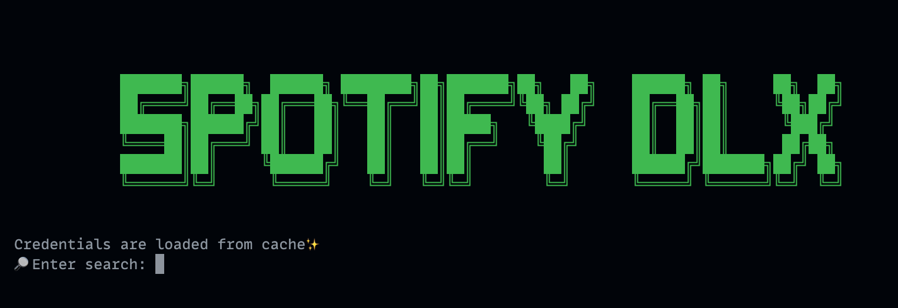

# Spotify-DLX

```bash

   ███████╗██████╗  ██████╗ ████████╗██╗███████╗██╗   ██╗    ██████╗ ██╗     ██╗  ██╗
   ██╔════╝██╔══██╗██╔═══██╗╚══██╔══╝██║██╔════╝╚██╗ ██╔╝    ██╔══██╗██║     ╚██╗██╔╝
   ███████╗██████╔╝██║   ██║   ██║   ██║█████╗   ╚████╔╝     ██║  ██║██║      ╚███╔╝
   ╚════██║██╔═══╝ ██║   ██║   ██║   ██║██╔══╝    ╚██╔╝      ██║  ██║██║      ██╔██╗
   ███████║██║     ╚██████╔╝   ██║   ██║██║        ██║       ██████╔╝███████╗██╔╝ ██╗
   ╚══════╝╚═╝      ╚═════╝    ╚═╝   ╚═╝╚═╝        ╚═╝       ╚═════╝ ╚══════╝╚═╝  ╚═╝
```

Downloads songs and podcasts from any Spotify playlist, album or track easily.

The purpose of this project is to provide simple and easy Spotify CLI/client to downloads songs and podcasts with beautiful terminal UI.


## Usage

### CLI

```bash
$ python -m spotify_dlx
```

Then cool UI will appear.




### Options

```
--root         : Root path to download songs. Default is $HOME/spotify_dlx/songs/.
--root-podcast : Root path to download songs. Default is $HOME/spotify_dlx/podcasts/.
--url          : Specific url for track, album, playlist or episode. Optional.
--liked        : If specified, download all liked songs.
--playlist     : If specified, download songs from user's playlist.
--disable-skip : If specified, disable to skip already downloaded audio.
--format       : wav or mp3.
--limit        :  Search limits.
```


### Client
```python
>>> from spotify_dlx import SpotifyDLXClient
>>> client = SpotifyDLXClient()
>>> client.login(username="USERNAME", password="PASSWORD")
>>> client.search("Billie Eilish")
```


## Installation

### requirements

`ffmpeg` and `librespot` are required.

Run following commands.

```bash
$ pip install git+https://github.com/kokarare1212/librespot-python

$ brew install ffmpeg # Mac
```

### pip

```bash
$ pip install spotify_dlx
```

### Manual

```bash
$ git clone git@github.com:ozora-ogino/spotify_dlx.git
$ cd  spotify_dlx
$ pip install -e .
```

## Frequently Asked QUestion

### What's the difference between `spotify_dl`?
As you know, [`spotify_dl`](https://github.com/SathyaBhat/spotify-dl) is awesome and high quality library.

But I want to download spotify songs by cli and make the process simpler and this is it.


## Contribution

This is still personal toy project, however Contribution is welcome.

I recommend to understand following topics.

 - [Writing a Good PR (Google's Best Practice)](https://developers.google.com/blockly/guides/modify/contribute/write_a_good_pr)
 - [GitFlow](https://www.atlassian.com/git/tutorials/comparing-workflows/gitflow-workflow)
 - [COde of Conduct](https://opensource.guide/code-of-conduct/)
